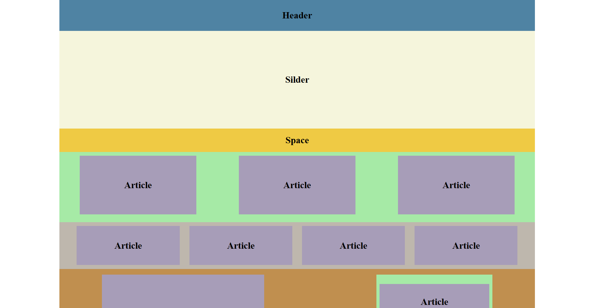
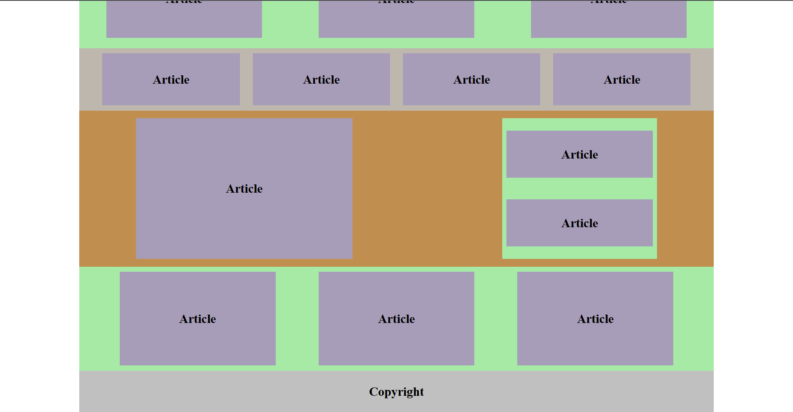
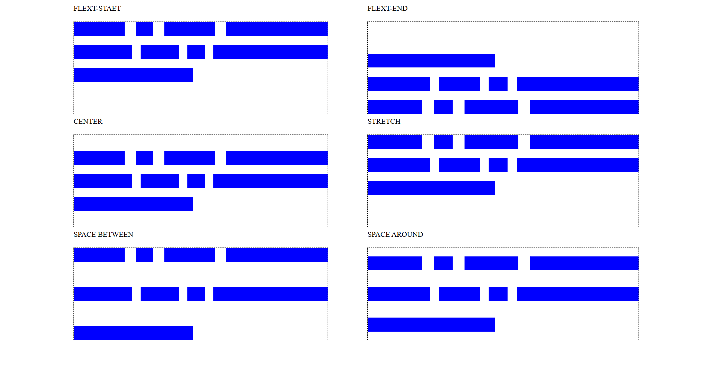

# Layout Design in Flex

Overview
--------

This example demonstrates a multi-section page layout implemented using CSS Flexbox. The layout is organized into clear horizontal bands (Header, Slider, Space, multiple Article rows, Featured area, and Footer) and uses flex containers to create responsive, evenly spaced blocks.

Files
-----

- `index.html` — Demo entry page for the flex-based layout.
- `css/index.css` — Base styles and global resets.
- `css/layout_1.css` — Main layout styles that demonstrate the flex techniques used in this design.
- `css/stretch.css` — Alternate layout variations (stretching behavior examples).
- `img/` — Images used by the layout. Add the preview image as `img/img/screenshort-1.png` to display in this README.
- `pages/layout_1.html` — Example subpage showing the layout in context.
- `pages/stretch.html` — Alternate demo page.

Layout structure
----------------

- Header: a full-width band with centered content (uses flex to center horizontally/vertically).
- Slider: a tall band used for hero/banner content. Typically centered text with generous vertical padding.
- Space: a narrow band used as a colored separator between sections.
- Article rows: repeated flex rows containing article cards. Cards use flexible growth and wrapping to adapt across screen sizes.
- Featured area: a two-column flex area (large article on the left, stacked smaller articles on the right) demonstrating nested flex containers.
- Footer (Copyright): a full-width band at the bottom.

How Flex is used
-----------------

- Rows are implemented with `display: flex; flex-wrap: wrap;` so article cards wrap to the next line when space is limited.
- Article cards commonly use `flex: 1 1 30%;` (or similar) to allow three-up layouts on wide screens and automatic stacking on narrow screens.
- The featured area nests flex containers: the outer container lays out the main/aside columns, the aside column itself is a column-oriented flex container to stack the smaller articles.
- Centering is handled with `justify-content: center; align-items: center;` on the containers where required.

Responsive behavior
-------------------

- The layout relies on flexible widths and `flex-wrap` so it responds naturally to viewport width changes.
- Media queries in `css/layout_1.css` adjust `flex-basis`, paddings, and font sizes to improve readability on smaller screens (e.g., switching from three columns to one column under ~700px).
# Layout Design in Flex

Overview
--------

This example demonstrates a multi-section page layout implemented using CSS Flexbox. The layout is organized into clear horizontal bands (Header, Slider, Space, multiple Article rows, Featured area, and Footer) and uses flex containers to create responsive, evenly spaced blocks.

Files
-----

- `index.html` — Demo entry page for the flex-based layout.
- `css/index.css` — Base styles and global resets.
- `css/layout_1.css` — Main layout styles that demonstrate the flex techniques used in this design.
- `css/stretch.css` — Alternate layout variations (stretching behavior examples).
- `img/` — Images used by the layout. The screenshots for this README are `img/screenshort-1.png`, `img/screenshort-2.png`, and `img/stretch.png` (stretch example).
- `pages/layout_1.html` — Example subpage showing the layout in context.
- `pages/stretch.html` — Alternate demo page.

Layout structure
----------------

- Header: a full-width band with centered content (uses flex to center horizontally/vertically).
- Slider: a tall band used for hero/banner content. Typically centered text with generous vertical padding.
- Space: a narrow band used as a colored separator between sections.
- Article rows: repeated flex rows containing article cards. Cards use flexible growth and wrapping to adapt across screen sizes.
- Featured area: a two-column flex area (large article on the left, stacked smaller articles on the right) demonstrating nested flex containers.
- Footer (Copyright): a full-width band at the bottom.

How Flex is used
-----------------

- Rows are implemented with `display: flex; flex-wrap: wrap;` so article cards wrap to the next line when space is limited.
- Article cards commonly use `flex: 1 1 30%;` (or similar) to allow three-up layouts on wide screens and automatic stacking on narrow screens.
- The featured area nests flex containers: the outer container lays out the main/aside columns, the aside column itself is a column-oriented flex container to stack the smaller articles.
- Centering is handled with `justify-content: center; align-items: center;` on the containers where required.

Responsive behavior
-------------------

- The layout relies on flexible widths and `flex-wrap` so it responds naturally to viewport width changes.
- Media queries in `css/layout_1.css` adjust `flex-basis`, paddings, and font sizes to improve readability on smaller screens (e.g., switching from three columns to one column under ~700px).

Customization
-------------

- Colors & spacing: Edit variables or the color blocks in the stylesheet to change theme colors and vertical rhythm (margins/padding).
- Column counts: Adjust `flex-basis` or the `flex` shorthand on the article cards to change how many cards appear per row at different breakpoints.
- Featured section layout: Swap the order of columns or change the `flex` ratios to emphasize different content.

Viewing the demos
-----------------

- Open `index.html` in a browser to see the primary demo.
- See variations in `pages/layout_1.html` and `pages/stretch.html`.

Notes
-----

- The README includes two preview images located in `img/screenshort-1.png` and `img/screenshort-2.png` and `img/stretch.png`.
- If you prefer different filenames, upload the images and I will update the references accordingly.

Credits
-------

Layout created as part of the UI/CSS layout examples collection.
