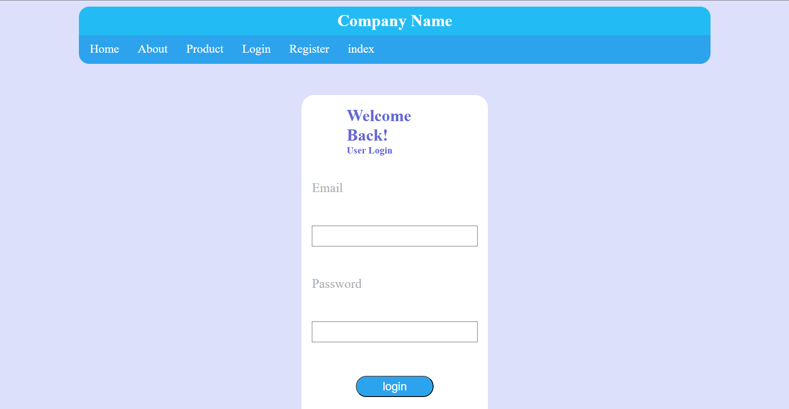
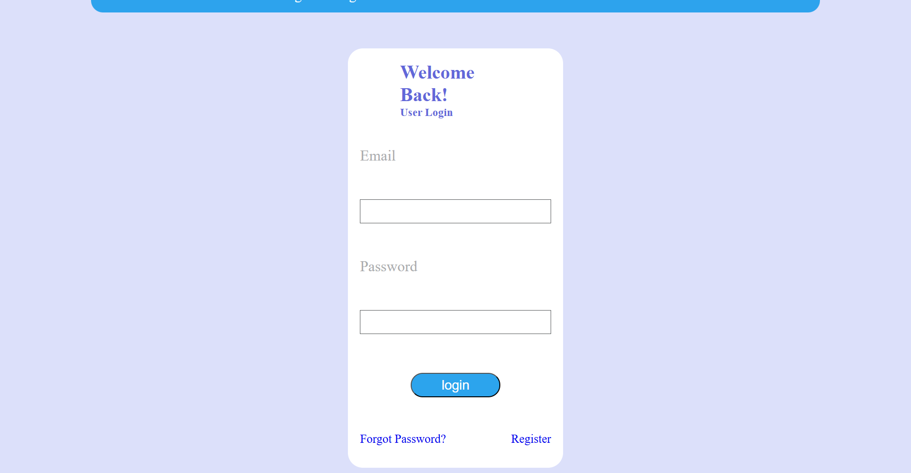
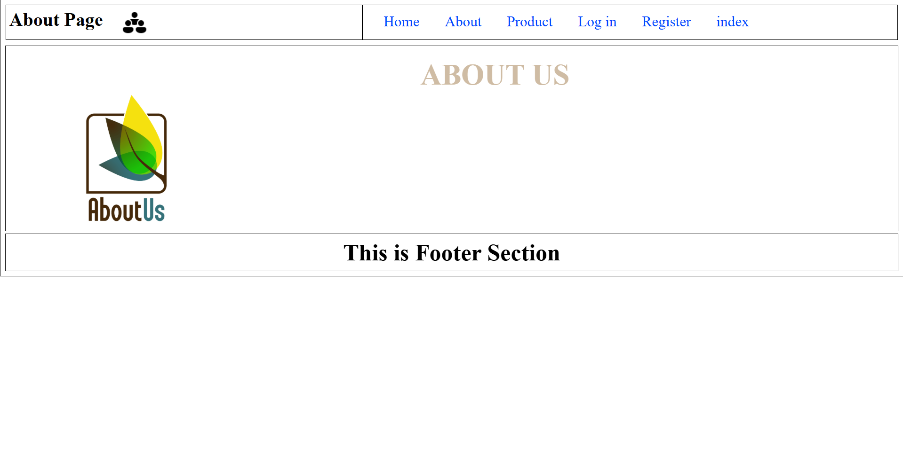
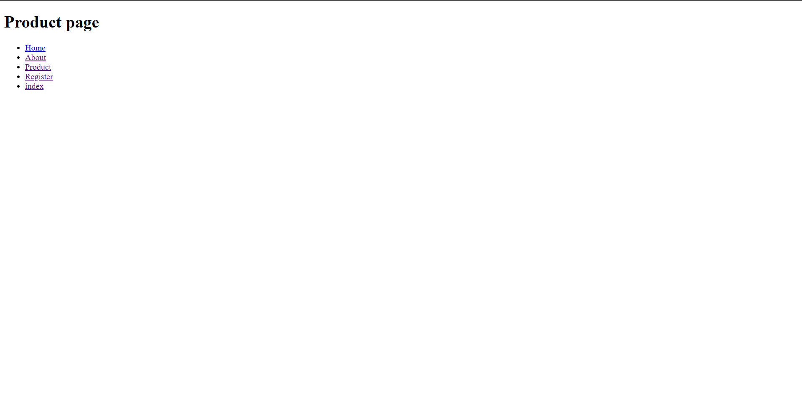
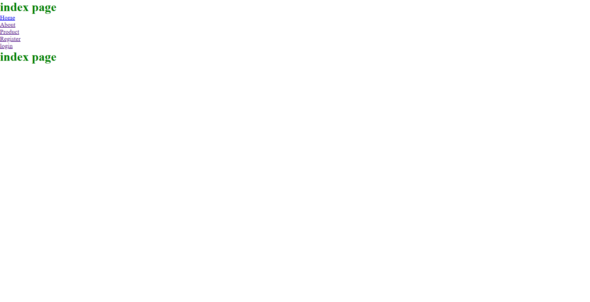
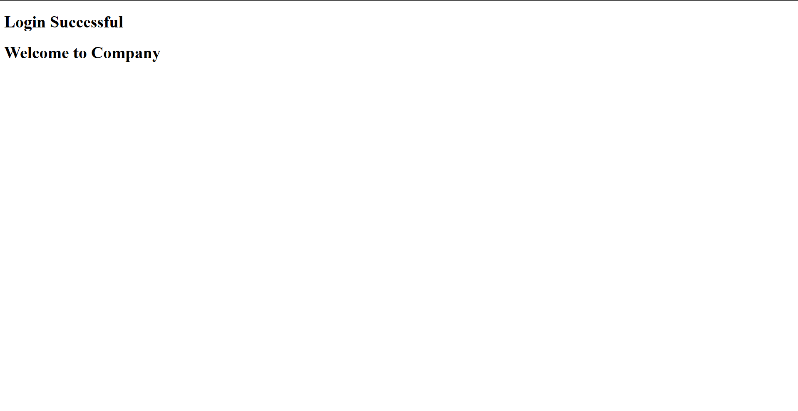

# Layout Design (Grid & Flex examples)

This folder contains small page examples and components demonstrating layout patterns used across the collection. The examples include responsive pages for login, register, product, and informational pages that combine Grid and Flexbox techniques.

Preview screenshots
-------------------

Below are the available preview images for the pages in this folder.

Overview
--------

- `index-page.png` — Homepage layout combining header, hero, and content blocks.
- `about-page.png`, `about-page.png` — About pages showing content sections and responsive text/image layouts.
- `product-page.png` — Product listing / detail layout.
- `register-page.png`, `forgot-pass.png` — Form pages demonstrating form layout, input styling, and validation states.
- `login-1.png`, `login-2.png`, `login-succ.png` — Login form variants and post-login success view.

Files
-----

- `css/` — Stylesheets used by these pages.
- `img/` — Images and preview screenshots (the files above).
- `pages/` — Example HTML pages (if present) that demonstrate how components are assembled.

How layouts are implemented
---------------------------

- Grid: used for overall page structure where two-dimensional placement is required (for example header+hero+content areas). Look for `display: grid`, `grid-template-areas`, and `grid-template-columns` in the CSS files.
- Flexbox: used inside components (navbars, card rows, form controls) for one-dimensional alignment and spacing. Look for `display: flex`, `flex-direction`, and `flex-wrap`.

Viewing
-------

- Open the example HTML files in this folder (or the top-level pages in `Layout_design/pages/`) in your browser or use Live Server to preview.
- To update screenshots, replace the files in `img/` and the README will render the new images automatically.

If you want, I can also:
- Add captions under each image with more detail, or
- Reorder or rename the screenshots for consistent naming (for example `preview-01-index.png`).

