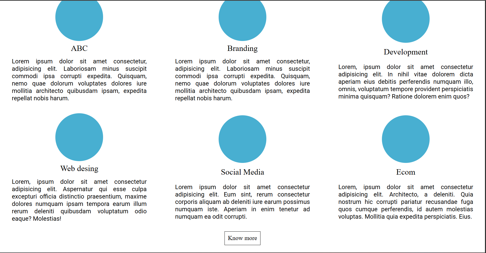
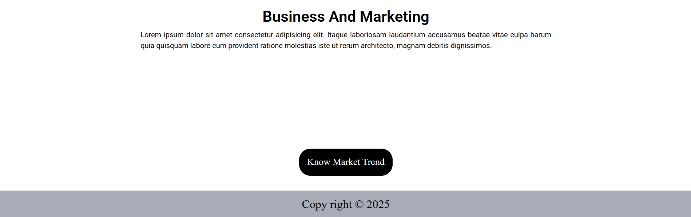

# Responsive Layout — Business Co

A responsive landing page layout demonstrating fluid grid, flexible components, and mobile-first CSS. This repository includes the HTML, CSS, and screenshots showing how the layout adapts across viewports.

Live demo: https://responsive-design-dev.netlify.app/

## Project Structure

- index.html — main markup
- index.css — styles and responsive breakpoints
- imgs/ — screenshots and images used in the layout

## Responsive Design

Summary of approach and breakpoints used:

- Mobile-first layout with CSS Grid and Flexbox.
- Key breakpoint ranges used in `index.css`:
	- 250px — 450px: very small screens / small phones
	- 500px — 765px: small to medium phones and small tablets
	- 766px — 890px: medium tablets and narrow desktops
	- 765px — 1390px: wider tablets and desktop ranges

Design notes:

- The header switches between stacked and inline navigation depending on available width.
- The hero/slider uses a background image with an absolutely positioned content block for scalable typography.
- Sections use grid areas and repeat() columns so content reflows gracefully from 3-column to single-column layouts.
- Buttons and interactive elements use visible focus/hover states; images use `object-fit: cover` for consistent cropping.

Testing recommendations:

- Test in Chrome/Edge/Firefox and mobile emulation for widths: 360px, 375px, 412px, 768px, 1024px, 1366px.
- Use browser devtools to toggle device mode and ensure images and text scale without overlap.

## Screenshots

If the images are present in the `imgs/` folder they will render here when viewing this README on GitHub or locally.

## View locally

Open `index.html` in a browser (File → Open File or drag into a browser window).

## Live / Deployed

This project is deployed at: https://responsive-design-dev.netlify.app/
