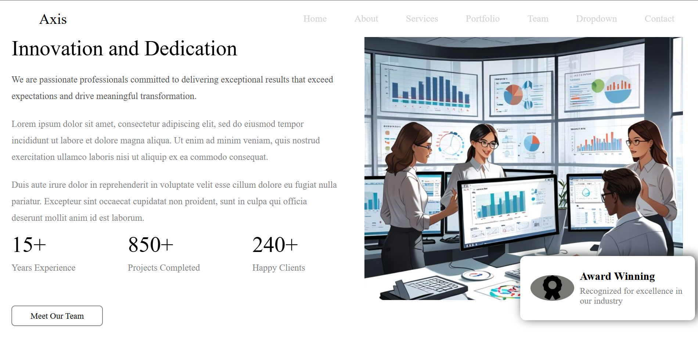
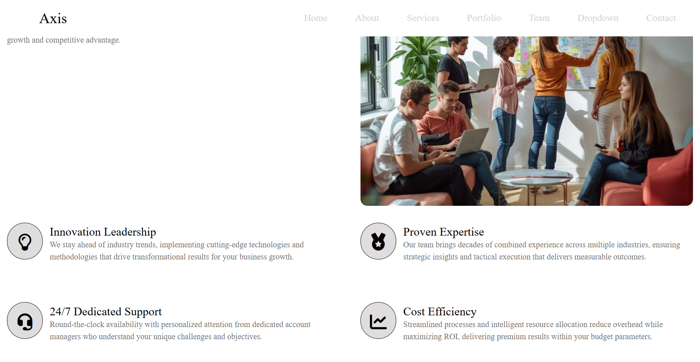

# Axis - Business Solution UI Template

A modern, responsive business website template built with HTML, CSS, and Font Awesome icons. Axis is a professional UI template designed to showcase business services, team expertise, and company achievements.

## 📋 Table of Contents

- [Overview](#overview)
- [Features](#features)
- [Project Structure](#project-structure)
- [Sections](#sections)
- [Technologies Used](#technologies-used)
- [Installation & Setup](#installation--setup)
- [Customization Guide](#customization-guide)
- [Screenshots](#screenshots)
- [Browser Support](#browser-support)
- [Credits](#credits)

---

## 🎯 Overview

Axis is a professional, fully responsive business template that provides a modern interface for presenting company services, team information, and business solutions. The template features smooth scrolling, interactive elements, and a clean design suitable for agencies, consulting firms, and service-based businesses.

### Key Highlights:
- ✨ Modern and professional design
- 📱 Fully responsive layout
- 🎨 Custom CSS Grid layout
- ⚡ Smooth scroll behavior
- 🔄 Interactive hover effects
- 🎯 Easy to customize

---

## ✨ Features

### Design Features
- **Sticky Navigation Header** - Navigation stays visible while scrolling
- **Service Cards** - 6 service offerings with icons and descriptions
- **About Section** - Company information with achievements and statistics
- **Why Choose Us** - Key benefits showcased with icons and detailed descriptions
- **Award Badge** - Recognition display on the about section image
- **Revenue Growth Widget** - Floating statistics card on hero image

### Interactive Elements
- Smooth hover transitions on menu items
- Animated button effects
- Interactive service cards with shadow effects
- Icon animations on hover
- Underline animation on "Why Choose Us" heading

---

## 📁 Project Structure

```
Template-1/
├── index.html          # Main HTML file
├── css/
│   └── index.css       # Styling and layout
├── img/                # Image assets folder
│   ├── meeting.jpg
│   ├── ground-img.jpg
│   └── Support and follow my pinterest account and….jpg
└── icons/              # Icons folder (for future use)
```

---

## 🏗️ Sections

### 1. **Header / Navigation**
- Logo (Title: "Axis")
- Navigation menu with links to:
  - Home
  - About
  - Services
  - Portfolio
  - Team
  - Dropdown
  - Contact

### 2. **Home Section**
- Headline: "Transform Your Business Vision Into Reality"
- Descriptive text about services
- Two CTA buttons:
  - "Get Started Today" (dark button)
  - "Watch Demo" (icon button)
- Statistics cards (500+ Projects, 98% Satisfaction, 10+ Years)
- Hero image with floating revenue growth widget

### 3. **About Section**
- Company introduction
- "About Us" heading with description
- Detailed company information across 3 paragraphs
- Statistics display:
  - 15+ Years Experience
  - 850+ Projects Completed
  - 240+ Happy Clients
- "Meet Our Team" button
- Team meeting image with award-winning badge

### 4. **Services Section**
- Section heading with description
- 6 service cards in 3x2 grid:
  - **Strategic Consulting** - Chart Gantt icon
  - **Brand Development** - Palette icon
  - **Digital Solutions** - Code icon
  - **Marketing Strategy** - Bullhorn icon
  - **Team Building** - User Group icon
  - **Data Analytics** - Chart icon

### 5. **Why Choose Us Section**
- Headline and description
- 4 key benefits:
  - **Innovation Leadership** - Lightbulb icon
  - **Proven Expertise** - Medal icon
  - **24/7 Dedicated Support** - Headset icon
  - **Cost Efficiency** - Chart Line icon
- "Why Partner With Us" section
- Feature image with hover effect

---

## 🛠️ Technologies Used

### Frontend
- **HTML5** - Semantic markup structure
- **CSS3** - Advanced styling and animations
  - CSS Grid Layout
  - Flexbox
  - Transitions & Transforms
  - Media Queries (responsive design)
- **Font Awesome 7.0.1** - Icon library

### Features Utilized
- **CSS Grid** - Complex multi-section layout
- **Flexbox** - Component alignment and spacing
- **CSS Transitions** - Smooth animations (0.4s - 0.9s)
- **Box Shadows** - Depth and elevation effects
- **Border Radius** - Modern rounded corners
- **Viewport Units** - Responsive typography (vw/vh)

---

## 💻 Installation & Setup

### Prerequisites
- Any modern web browser
- Text editor (VS Code, Sublime Text, etc.) - optional for customization

### Steps

1. **Clone or Download the Project**
   ```bash
   git clone <repository-url>
   # or download the ZIP file
   ```

2. **Navigate to Project Folder**
   ```bash
   cd Template-1
   ```

3. **Open in Browser**
   - Double-click `index.html` file, or
   - Right-click → "Open with" → Select your browser, or
   - Use VS Code Live Server extension

4. **No Build Process Required**
   - This is a static HTML/CSS project
   - No npm or package installation needed

---

## 🎨 Customization Guide

### Changing Colors

Edit `css/index.css` to modify color scheme:

```css
/* Primary Dark Color */
background-color: #313131;  /* Change button background */

/* Secondary Gray */
color: #848587;             /* Change text color */

/* Accent Green */
color: #22C55E;             /* Change accent color */

/* Light Gray Background */
background-color: #f2efef;  /* Change section background */
```

### Updating Content

1. **Header Title**
   - Open `index.html`
   - Find `<h1>Axis</h1>` and replace with your company name

2. **Navigation Links**
   - Update `href` attributes in the menu `<a>` tags

3. **Text Content**
   - Replace Lorem Ipsum text with your actual content
   - Update service descriptions
   - Change statistics and achievements

4. **Images**
   - Replace image files in `img/` folder
   - Keep same filenames or update `src` paths in HTML

5. **Button Links**
   - Update `href` attributes in CTA buttons
   - Add proper contact/portfolio links

### Adjusting Layout

**Grid Rows** (adjust section heights):
```css
.container {
  grid-template-rows: 80px 90vh auto auto 100vh;
  /* Change these values to adjust section heights */
}
```

**Button Styling**:
```css
.btn-1 {
  padding: 15px;           /* Adjust button padding */
  background-color: #313131; /* Change button color */
  border-radius: 8px;      /* Change rounded corners */
}
```

---

## 📸 Screenshots

### Screenshot 1 - Header & Navigation


### Screenshot 2 - About Section


### Screenshot 3 - Home with Revenue Widget


### Screenshot 4 - Services Section


### Screenshot 5 - Services Section


### Screenshot 6 - Why Choose Us


### Screenshot 7 - Footer & Bottom Section


---

## 🌐 Browser Support

| Browser | Support |
|---------|---------|
| Chrome  | ✅ Full |
| Firefox | ✅ Full |
| Safari  | ✅ Full |
| Edge    | ✅ Full |
| IE 11   | ⚠️ Partial |

**Note:** Modern CSS features like Grid and Flexbox require modern browsers.

---

## 📱 Responsive Design

The template is designed to be responsive across:
- 📺 **Desktop** (1920px+)
- 💻 **Laptop** (1024px - 1920px)
- 📱 **Tablet** (768px - 1024px)
- 📲 **Mobile** (320px - 768px)

For mobile optimization, additional media queries can be added to `css/index.css`.

---

## 🎯 CSS Grid Layout

The main container uses CSS Grid with 5 main sections:

```css
.container {
  grid-template-areas:
    "header"      /* Navigation */
    "home"        /* Hero Section */
    "about"       /* About Us */
    "services"    /* Services */
    "why-us";     /* Why Choose Us */
}
```

---

## 🔧 Key CSS Classes Reference

### Structural Classes
- `.container` - Main layout grid
- `.header` - Navigation bar
- `.home` - Hero section
- `.about` - About us section
- `.services` - Services grid
- `.why-us` - Why choose us section

### Component Classes
- `.box` - Service/info card
- `.btn-1`, `.btn-2` - Button styles
- `.item-why` - Why us item box
- `.hero` - Statistics box container
- `.award-winning` - Award badge
- `.revenue` - Revenue widget

---

## 📝 Code Quality

- **HTML5 Semantic Tags** - Proper structure
- **CSS Grid & Flexbox** - Modern layout techniques
- **Vendor Prefixes** - Cross-browser compatibility
  - `-webkit-` (Chrome, Safari)
  - `-moz-` (Firefox)
  - `-ms-` (Internet Explorer)
  - `-o-` (Opera)

---

## 🚀 Performance Tips

1. **Image Optimization**
   - Compress images using TinyPNG or similar tools
   - Use WebP format for better compression

2. **CSS Optimization**
   - Remove unused CSS rules
   - Minify CSS for production

3. **Font Icons**
   - Currently using Font Awesome CDN
   - Consider self-hosting for better performance

---

## 🔗 External Resources

- **Font Awesome Icons**: https://fontawesome.com/
- **CSS Grid Guide**: https://css-tricks.com/snippets/css/complete-guide-grid/
- **Flexbox Guide**: https://css-tricks.com/snippets/css/a-guide-to-flexbox/

---

## 📄 License

This template is available for personal and commercial use.

---

## 👤 Credits

**Original Design**: Based on Bootstrap template
**Reference**: https://bootstrapmade.com/demo/Axis/

---

## 📧 Support & Contact

For customization needs or questions:
- Review the Customization Guide section above
- Check CSS comments for specific styling details
- Test changes in a modern web browser

---

## 🎓 Learning Resources

This project is great for learning:
- CSS Grid advanced layouts
- Flexbox implementation
- Responsive web design
- CSS animations and transitions
- HTML semantic structure
- Icon integration with Font Awesome

---

**Last Updated**: 2024
**Version**: 1.0
**Status**: Production Ready ✅
# Axis - Business Solution UI Template

A modern, responsive business website template built with HTML, CSS, and Font Awesome icons. Axis is a professional UI template designed to showcase business services, team expertise, and company achievements.

## 📋 Table of Contents

- [Overview](#overview)
- [Features](#features)
- [Project Structure](#project-structure)
- [Sections](#sections)
- [Technologies Used](#technologies-used)
- [Installation & Setup](#installation--setup)
- [Customization Guide](#customization-guide)
- [Project Documentation](#project-documentation)
- [Screenshots](#screenshots)
- [Browser Support](#browser-support)
- [Credits](#credits)

---

## 🎯 Overview

Axis is a professional, fully responsive business template that provides a modern interface for presenting company services, team information, and business solutions. The template features smooth scrolling, interactive elements, and a clean design suitable for agencies, consulting firms, and service-based businesses.

### Key Highlights:
- ✨ Modern and professional design
- 📱 Fully responsive layout
- 🎨 Custom CSS Grid layout
- ⚡ Smooth scroll behavior
- 🔄 Interactive hover effects
- 🎯 Easy to customize

---

## ✨ Features

### Design Features
- **Sticky Navigation Header** - Navigation stays visible while scrolling
- **Hero Section** - Eye-catching home section with call-to-action buttons
- **Service Cards** - 6 service offerings with icons and descriptions
- **About Section** - Company information with achievements and statistics
- **Why Choose Us** - Key benefits showcased with icons and detailed descriptions
- **Award Badge** - Recognition display on the about section image
- **Revenue Growth Widget** - Floating statistics card on hero image

### Interactive Elements
- Smooth hover transitions on menu items
- Animated button effects
- Interactive service cards with shadow effects
- Icon animations on hover
- Underline animation on "Why Choose Us" heading

---

## 📁 Project Structure

```
Template-1/
├── index.html          # Main HTML file
├── css/
│   └── index.css       # Styling and layout
├── img/                # Image assets folder
│   ├── meeting.jpg
│   ├── ground-img.jpg
│   ├── Support and follow my pinterest account and….jpg
│   ├── screenshot1.jpg
│   ├── screenshot2.jpg
│   ├── screenshot3.jpg
│   ├── screenshot4.jpg
│   ├── screenshot5.jpg
│   ├── screenshot6.jpg
│   └── screenshot7.jpg
├── icons/              # Icons folder (for future use)
└── README.md           # Project documentation
```

---

## 🏗️ Sections

### 1. **Header / Navigation**
- **Logo**: "Axis" branding
- **Navigation Menu** with links to:
  - Home
  - About
  - Services
  - Portfolio
  - Team
  - Dropdown
  - Contact
- **Sticky Positioning**: Header remains visible while scrolling
- **Hover Effects**: Smooth transitions and shadow effects on menu items

### 2. **Home Section (Hero)**
- **Headline**: "Transform Your Business Vision Into Reality"
- **Description**: Engaging copy about services
- **CTA Buttons**:
  - "Get Started Today" (dark button with hover effect)
  - "Watch Demo" (icon button with play icon)
- **Statistics Cards**:
  - 500+ Successful Projects
  - 98% Client Satisfaction
  - 10+ Years Experience
- **Hero Image**: Professional business meeting photo
- **Revenue Growth Widget**: Floating card displaying +45% revenue growth

### 3. **About Section**
- **Section Header**: "About Us" with introductory description
- **Company Information**: Multi-paragraph company narrative
- **Key Statistics**:
  - 15+ Years Experience
  - 850+ Projects Completed
  - 240+ Happy Clients
- **CTA Button**: "Meet Our Team"
- **Team Meeting Image**: Professional team photo
- **Award Badge**: "Award Winning" recognition display with icon

### 4. **Services Section**
- **Section Heading**: "What We Do Offer" with description
- **6 Service Cards** (3x2 Grid Layout):
  1. **Strategic Consulting** - Chart Gantt icon
  2. **Brand Development** - Palette icon
  3. **Digital Solutions** - Code icon
  4. **Marketing Strategy** - Bullhorn icon
  5. **Team Building** - User Group icon
  6. **Data Analytics** - Chart Simple icon
- **Card Features**:
  - Circular icon containers with dark background
  - Service title and description
  - "Learn More" link with arrow animation
  - Hover shadow effects

### 5. **Why Choose Us Section**
- **Section Title**: "Why Choose Us"
- **Partner Section**: "Why Partner With Us" with detailed description
- **Feature Image**: Professional business/office photo
- **4 Key Benefits**:
  1. **Innovation Leadership** (Lightbulb icon)
  2. **Proven Expertise** (Medal icon)
  3. **24/7 Dedicated Support** (Headset icon)
  4. **Cost Efficiency** (Chart Line icon)
- **Benefits Display**: Icon-text layout with hover effects

---

## 🛠️ Technologies Used

### Frontend Stack
- **HTML5** - Semantic markup structure
- **CSS3** - Advanced styling and animations
  - CSS Grid Layout
  - Flexbox
  - Transitions & Transforms
  - Media Queries (responsive design)
- **Font Awesome 7.0.1** - Icon library (CDN)

### CSS Features Utilized
- **CSS Grid** - Complex multi-section layout
  - 5 main grid areas: header, home, about, services, why-us
  - Nested grids for services and about sections
- **Flexbox** - Component alignment and spacing
- **CSS Transitions** - Smooth animations (0.4s - 0.9s)
- **Box Shadows** - Depth and elevation effects
- **Border Radius** - Modern rounded corners
- **Viewport Units** - Responsive typography (vw/vh)
- **Vendor Prefixes** - Cross-browser compatibility

### Performance Features
- Smooth scroll behavior
- Hardware-accelerated transitions
- Optimized layout patterns

---

## 💻 Installation & Setup

### Prerequisites
- Any modern web browser (Chrome, Firefox, Safari, Edge)
- Text editor (VS Code, Sublime Text, etc.) - optional for customization
- No build tools or dependencies required

### Steps

1. **Clone or Download the Project**
   ```bash
   git clone <repository-url>
   # or download the ZIP file
   ```

2. **Navigate to Project Folder**
   ```bash
   cd Template-1
   ```

3. **Open in Browser**
   - **Option 1**: Double-click `index.html` file
   - **Option 2**: Right-click → "Open with" → Select your browser
   - **Option 3**: Use VS Code Live Server extension
     ```bash
     # Install Live Server extension in VS Code
     # Right-click index.html → Open with Live Server
     ```

4. **Verify Setup**
   - All sections should load properly
   - Smooth scrolling should work
   - Hover effects should be visible
   - Images should display correctly

5. **No Build Process Required**
   - This is a static HTML/CSS project
   - No npm or package installation needed
   - No compilation step required

---

## 🎨 Customization Guide

### Changing Colors

Edit [css/index.css](css/index.css) to modify the color scheme:

```css
/* Primary Dark Color - Buttons & Icons */
background-color: #313131;  /* Change button background */

/* Secondary Gray - Text & Borders */
color: #848587;             /* Change text color */

/* Accent Green - Highlights */
color: #22C55E;             /* Change accent color (e.g., revenue growth) */

/* Light Gray Background - Sections */
background-color: #f2efef;  /* Change section background */

/* Light Gray - Secondary backgrounds */
background-color: #f2f1f1;  /* Change secondary section background */
```

### Color Palette Reference

| Color | Hex Code | Usage |
|-------|----------|-------|
| Dark Charcoal | `#313131` | Primary buttons, icon backgrounds |
| Medium Gray | `#848587` | Secondary text, borders |
| Accent Green | `#22C55E` | Highlights, success indicators |
| Light Gray | `#f2efef` | Section backgrounds |
| Light Gray 2 | `#f2f1f1` | Alternate section backgrounds |
| Dark Gray | `#515254` | Primary text |
| Medium Light Gray | `#707070` | Body text |
| Light Gray Border | `#858585` | Border colors |

### Updating Content

1. **Header Title**
   - Open [index.html](index.html)
   - Find `<h1>Axis</h1>` and replace with your company name
   - Example: `<h1>MyCompany</h1>`

2. **Navigation Links**
   - Update `href` attributes in the menu `<a>` tags
   - Example: `<a href="#services">Services</a>`

3. **Text Content**
   - Replace Lorem Ipsum text with your actual content
   - Update service descriptions
   - Change statistics and achievements
   - Update team information

4. **Images**
   - Replace image files in `img/` folder:
     - `meeting.jpg` - Hero section image
     - `ground-img.jpg` - Why Choose Us section
     - `Support and follow my pinterest account and….jpg` - About section
   - Keep same filenames or update `src` paths in HTML
   - Recommended image sizes:
     - Hero image: 1200x800px minimum
     - About/Why Us images: 800x600px minimum

5. **Button Links**
   - Update `href` attributes in CTA buttons
   - Add proper contact/portfolio links
   - Example: 
     ```html
     <a href="https://example.com/contact">Get Started Today</a>
     ```

### Adjusting Layout

**Grid Row Heights** (adjust section heights):
```css
.container {
  grid-template-rows: 80px 90vh auto auto 100vh;
  /* Change these values to adjust section heights */
  /* 80px - Header */
  /* 90vh - Hero/Home section */
  /* auto - About section (auto-sized) */
  /* auto - Services section (auto-sized) */
  /* 100vh - Why Choose Us section */
}
```

**Button Styling**:
```css
.btn-1 {
  padding: 15px;              /* Adjust button padding */
  background-color: #313131;  /* Change button color */
  border-radius: 8px;         /* Change rounded corners */
  font-size: 1.2em;           /* Change text size */
}
```

**Service Card Grid**:
```css
.service-content {
  grid-template-columns: repeat(3, 1fr);  /* 3 columns - change to repeat(2, 1fr) for 2 columns */
  gap: 15px;                              /* Change spacing between cards */
}
```

**Typography Adjustments**:
```css
.home .business h1 {
  font-size: 3em;         /* Change headline size */
  font-weight: 300;       /* Change font weight (100-900) */
  line-height: 1.5;       /* Adjust line spacing */
}
```

### Responsive Design Modifications

To make the template more mobile-friendly, add media queries to [css/index.css](css/index.css):

```css
/* Tablet (768px - 1024px) */
@media (max-width: 1024px) {
  .service-content {
    grid-template-columns: repeat(2, 1fr);
  }
}

/* Mobile (320px - 768px) */
@media (max-width: 768px) {
  .container {
    grid-template-rows: 80px 100vh auto auto auto;
  }
  
  .service-content {
    grid-template-columns: repeat(1, 1fr);
  }
  
  .menu ul {
    flex-direction: column;
  }
  
  .home {
    flex-direction: column;
  }
}
```

---

## 📚 Project Documentation

### CSS Grid Structure

The main container uses a sophisticated CSS Grid layout:

```css
.container {
  display: grid;
  grid-template-columns: repeat(1, 1fr);
  grid-template-rows: 80px 90vh auto auto 100vh;
  grid-template-areas:
    "header"      /* Sticky navigation (80px) */
    "home"        /* Hero section (90% viewport height) */
    "about"       /* About us section (auto) */
    "services"    /* Services grid (auto) */
    "why-us";     /* Why choose us section (100% viewport height) */
}
```

### Key CSS Classes Reference

#### Structural Classes
| Class | Purpose | Grid Area |
|-------|---------|-----------|
| `.container` | Main layout grid | - |
| `.header` | Navigation bar | `header` |
| `.home` | Section | `home` |
| `.about` | About us section | `about` |
| `.services` | Services grid | `services` |
| `.why-us` | Why choose us section | `why-us` |

#### Component Classes
| Class | Purpose | Parent |
|-------|---------|--------|
| `.box` | Service/info card | `.service-content` or `.hero` |
| `.btn-1` | Primary button (dark) | `.get-start` |
| `.btn-2` | Secondary button (icon) | `.get-start` |
| `.item-why` | Why us benefit box | `.why-us` |
| `.hero` | Statistics box container | `.business` |
| `.award-winning` | Award badge | `.meeting-img` |
| `.revenue` | Revenue widget | `.business-img` |

#### Sub-component Classes
| Class | Purpose |
|-------|---------|
| `.business` | Text content |
| `.business-img` | Image container |
| `.about-us` | About section header |
| `.content` | About section text content |
| `.meeting-img` | About section image |
| `.service-heading` | Services section header |
| `.service-content` | Services cards grid |
| `.choose` | Why Us header |
| `.partner` | Why Us description |
| `.dis-img` | Why Us image |

### HTML Structure Breakdown

#### Header Section
```html
<div class="header">
  <div class="title">
    <h1>Axis</h1>
  </div>
  <div class="menu">
    <ul>
      <li><a href="#home">Home</a></li>
      <!-- More nav items -->
    </ul>
  </div>
</div>
```

#### Home/Hero Section
```html
<div class="home" id="home">
  <div class="business">
    <!-- Text content and CTA buttons -->
  </div>
  <div class="business-img">
    <!-- Image and revenue widget -->
  </div>
</div>
```

#### About Section
```html
<div class="about" id="about">
  <div class="about-us">
    <!-- Header -->
  </div>
  <div class="content">
    <!-- Text content -->
  </div>
  <div class="meeting-img">
    <!-- Image with award badge -->
  </div>
</div>
```

#### Services Section
```html
<div class="services" id="services">
  <div class="service-heading">
    <!-- Section header -->
  </div>
  <div class="service-content">
    <!-- 6 service cards -->
  </div>
</div>
```

#### Why Choose Us Section
```html
<div class="why-us">
  <div class="choose">
    <!-- Header -->
  </div>
  <div class="partner">
    <!-- Description -->
  </div>
  <div class="dis-img">
    <!-- Image -->
  </div>
  <div class="leader item-why">
    <!-- Benefit 1 -->
  </div>
  <!-- More benefits -->
</div>
```

### Animation & Transition Effects

| Element | Effect | Duration | Trigger |
|---------|--------|----------|---------|
| Menu links | Color change + shadow | 0.5s - 0.8s | Hover |
| Service cards | Shadow effect | 0.5s | Hover |
| Service icons | Slide right | 0.8s | Hover |
| Why Us icons | Background color invert | 0.1s | Hover |
| About image | Slight lift | 0.4s - 0.5s | Hover |
| Buttons | Padding change | 0.4s - 0.9s | Hover |

### Icons Used (Font Awesome 7.0.1)

| Icon | Class | Usage |
|------|-------|-------|
| Chart Gantt | `fa-chart-gantt` | Strategic Consulting |
| Palette | `fa-palette` | Brand Development |
| Code | `fa-code` | Digital Solutions |
| Bullhorn | `fa-bullhorn` | Marketing Strategy |
| User Group | `fa-user-group` | Team Building |
| Chart Simple | `fa-chart-simple` | Data Analytics |
| Lightbulb | `fa-lightbulb` | Innovation Leadership |
| Medal | `fa-medal` | Proven Expertise |
| Headset | `fa-headset` | 24/7 Support |
| Chart Line | `fa-chart-line` | Cost Efficiency & Revenue |
| Award | `fa-award` | Award Badge |
| Play Circle | `fa-circle-play` | Watch Demo |
| Arrow Right | `fa-arrow-right` | Learn More |

---

## 📸 Screenshots

### Screenshot 1 - Header & Navigation

*Sticky header with navigation menu and hover effects*

### Screenshot 2 - About Section

*Section with headline, CTA buttons, and statistics cards*

### Screenshot 3 - Home with Revenue Widget

*Image with floating revenue growth widget displaying +45%*

### Screenshot 4 - Services Section

*About us section with team image, award badge, and company statistics*

### Screenshot 5 - Services Section

*6 service cards in responsive grid layout with icons and descriptions*

### Screenshot 6 - Why Choose Us

*Four benefit cards with icons and detailed descriptions, along with feature image*

### Screenshot 7 - Full Page Overview

*Complete page layout showing all sections in one view*

---

## 🌐 Browser Support

| Browser | Support | Notes |
|---------|---------|-------|
| Chrome | ✅ Full | Latest versions recommended |
| Firefox | ✅ Full | Latest versions recommended |
| Safari | ✅ Full | v14+ for optimal CSS Grid support |
| Edge | ✅ Full | Chromium-based versions |
| IE 11 | ⚠️ Partial | CSS Grid not fully supported |

**Note:** Modern CSS features like CSS Grid and Flexbox require modern browsers. For IE11 support, consider using fallback layouts.

---

## 📱 Responsive Design

The template is designed to be responsive across all device sizes:

| Device | Screen Size | Breakpoint | Behavior |
|--------|------------|-----------|----------|
| Desktop | 1920px+ | - | Full layout, all features |
| Laptop | 1024px - 1920px | - | Optimized layout |
| Tablet | 768px - 1024px | @media (max-width: 1024px) | 2-column grid for services |
| Mobile | 320px - 768px | @media (max-width: 768px) | Single column layout |

For mobile optimization, add media queries to [css/index.css](css/index.css) as shown in the Customization Guide.

---

## 🎯 CSS Grid Layout Details

### Main Container Grid
```
┌─────────────────────────────────┐
│         HEADER (80px)           │  Sticky positioning
├─────────────────────────────────┤
│                                 │
│    HOME / BUSINESS (90vh)       │  Flex layout
│                                 │
├─────────────────────────────────┤
│ ABOUT-US (40vh)                 │  Full width header
├─────────┬───────────────────────┤
│ CONTENT │   MEETING-IMG         │  2-column layout
│         │   (100vh)             │
├─────────────────────────────────┤
│     SERVICES (auto)             │  Section header
├─────────────────────────────────┤
│   SERVICE-CONTENT (75vh)        │  3x2 grid of cards
├─────────────────────────────────┤
│      WHY-US (4 sections)        │  Complex grid layout
│  CHOOSE | DIS-IMG               │
│  PARTNER| DIS-IMG               │
│  LEADER | EXPERTISE             │
│  SUPPORT| COST                  │
└─────────────────────────────────┘
```

### Services Grid Layout
```
┌─────────────────────────────────────────┐
│    SERVICE HEADING (min-content)        │
├─────────────┬─────────────┬─────────────┤
│  Strategic  │ Brand Dev   │  Digital    │
│ Consulting  │ Development │ Solutions   │
├─────────────┼─────────────┼─────────────┤
│ Marketing   │   Team      │    Data     │
│ Strategy    │  Building   │ Analytics   │
└─────────────┴─────────────┴─────────────┘
3 columns, 2 rows
```

---

## 🚀 Performance Tips

1. **Image Optimization**
   - Compress images using TinyPNG, ImageOptim, or similar tools
   - Target sizes:
     - Section image: 1200x800px, 100-150KB
     - Section images: 800x600px, 80-120KB
   - Consider using WebP format for better compression
   - Use `object-fit: cover` to prevent distortion

2. **CSS Optimization**
   - Remove unused CSS rules
   - Minify CSS for production using tools like:
     - CSS Minifier
     - Gulp
     - Webpack
   - Combine vendor prefixes efficiently

3. **Font Icons**
   - Currently using Font Awesome CDN
   - For production, consider:
     - Self-hosting the font files
     - Using icon subsetting to reduce file size
     - Optimizing CDN caching headers

4. **General Optimization**
   - Enable gzip compression on server
   - Implement browser caching
   - Use a CDN for static assets
   - Minimize HTTP requests

---

## 🔗 External Resources

- **Font Awesome Icons**: https://fontawesome.com/
- **CSS Grid Guide**: https://css-tricks.com/snippets/css/complete-guide-grid/
- **Flexbox Guide**: https://css-tricks.com/snippets/css/a-guide-to-flexbox/
- **CSS Transitions**: https://developer.mozilla.org/en-US/docs/Web/CSS/CSS_Transitions
- **Responsive Design**: https://developer.mozilla.org/en-US/docs/Learn/CSS/CSS_layout/Responsive_Design

---

## 📄 License

This template is available for personal and commercial use.

---

## 👤 Credits

**Original Design**: Based on Bootstrap template  
**Reference**: https://bootstrapmade.com/demo/Axis/  
**Icons**: Font Awesome 7.0.1  
**Development**: Custom HTML5 & CSS3

---

## 📧 Support & Contact

For customization needs or questions:
- Review the Customization Guide section above
- Check CSS comments for specific styling details
- Test changes in a modern web browser
- Consult the Project Documentation section for detailed structure information

---

## 🎓 Learning Resources

This project is excellent for learning:
- **CSS Grid** - Advanced multi-section layout with nested grids
- **Flexbox** - Component alignment, centering, and spacing
- **Responsive Web Design** - Viewport units and media queries
- **CSS Animations** - Transitions and hover effects
- **HTML5 Semantics** - Proper document structure
- **Icon Integration** - Working with Font Awesome
- **Modern Web Design** - Professional UI/UX patterns

---

## 🔧 Troubleshooting

### Common Issues

**Issue**: Images not displaying
- **Solution**: Check image paths in HTML src attributes match file locations
- Ensure image files are in the `img/` folder

**Issue**: Styles not applying
- **Solution**: Clear browser cache (Ctrl+F5 or Cmd+Shift+R)
- Verify CSS file path in HTML: `<link rel="stylesheet" href="./css/index.css" />`

**Issue**: Icons not showing
- **Solution**: Check Font Awesome CDN link is working
- Verify internet connection for CDN access

**Issue**: Layout broken on mobile
- **Solution**: Add responsive media queries
- Test with browser developer tools (F12)

---

## 📝 Code Quality Standards

- **HTML5 Semantic Tags** - Proper structure and accessibility
- **CSS Grid & Flexbox** - Modern layout techniques
- **Vendor Prefixes** - Cross-browser compatibility
  - `-webkit-` (Chrome, Safari)
  - `-moz-` (Firefox)
  - `-ms-` (Internet Explorer)
  - `-o-` (Opera)
- **Comments** - Clear explanations of complex sections
- **Consistent Naming** - BEM-like class naming conventions

---

**Last Updated**: 2026  
**Version**: 1.0  
**Status**: Production Ready ✅  
**Maintenance**: Active