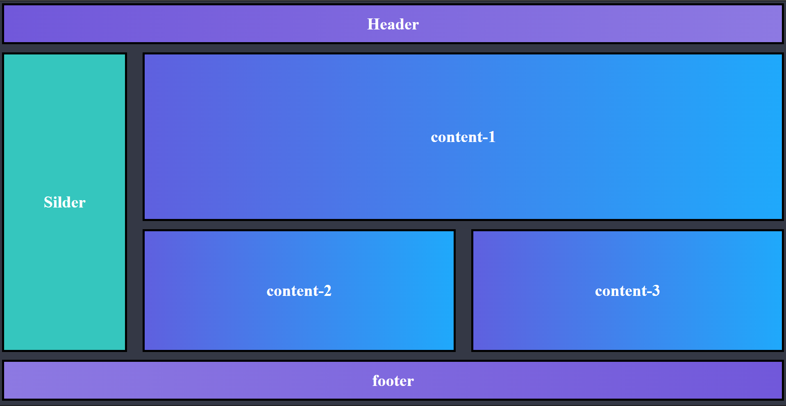

# Grid Template 1

Overview
--------

This example demonstrates a page layout implemented using CSS Grid. The layout divides the page into named grid areas (header, slider, content blocks, footer) so sections can be placed precisely on a two-dimensional grid.

Files
-----

- `index.html` — Demo page showing the grid layout structure.
- `index.css` — Grid definitions, area placement, and responsive rules.
- `img/grid_layout.png` — Screenshot preview used in this README.

Layout structure
----------------

- Header: full-width top area.
- Slider: a large banner area below the header.
- Content blocks: grid cells that can be arranged in rows/columns (examples use `grid-template-areas` to name regions like `content-1`, `content-2`, `content-3`).
- Footer: full-width bottom area.

How Grid is used
-----------------

- The layout uses `display: grid` on the main container with `grid-template-columns` and `grid-template-rows` to control the overall structure.
- `grid-template-areas` is used to place named sections into the grid, making the HTML semantic and the CSS easy to read.
- Individual content blocks can span multiple columns/rows using `grid-column` and `grid-row` or via the named areas.

Responsive notes
----------------

- At smaller viewports the stylesheet falls back to a single-column stacking layout using media queries that redefine the `grid-template-columns` and `grid-template-areas` for better readability on mobile.

Viewing the demo
----------------

- Open `index.html` in a browser to view the layout.
- Edit `index.css` to experiment with column counts, area sizes, and responsive breakpoints.

Credits
-------

Grid layout example from the UI/CSS collection.

