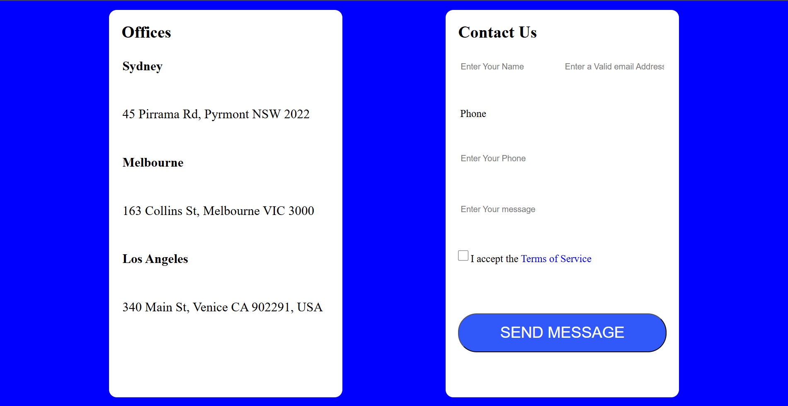

# Grid Template 3

Overview
--------

This demo shows a responsive page layout built with CSS Grid. The page uses named grid areas for the `title`, `header`, `slider`, `contactus` (office + contact form), and `footer` regions so content is placed precisely on a two-dimensional grid.

Files
-----

- `index.html` — Demo page showing the grid structure and content.
- `index.css` — Grid definitions, named areas, and responsive rules (media queries).
`img/screenshort-1.png` — Preview screenshot embedded above.

Additional screenshots
---------------------

- `img/screenshort-2.png` — Wide/desktop screenshot placeholder.
- `img/screenshort-1.png` — Stacked screenshot placeholder.

Layout summary
--------------

- Title: a thin full-width band at the very top.
- Header: contains logo, navigation, and contact number (uses flex inside the grid area).
- Slider: large hero area using a background image.
- Contact area: a two-column grid region with `office` info on the left and a `contact` form on the right.
- Footer: full-width band at the bottom.

How Grid is used
-----------------

- The main container uses `display: grid` and `grid-template-areas` to name each region, making it easy to rearrange placement in CSS.
- The `contactus` area is itself a grid with two columns, which keeps the office and contact form aligned and consistent across breakpoints.

Responsive tips
---------------

- Media queries in `index.css` reduce the layout to a single column on small screens (redefining `grid-template-columns` and `grid-template-areas`) so the content stacks vertically for mobile.
- Adjust `grid-template-rows` and the heights used for the slider/contact area if you need different vertical proportions.

Viewing
-------

- Open `index.html` in a browser to view the demo and inspect the grid areas in DevTools.

If you want a PNG screenshot instead of the SVG placeholder, upload it and I will replace `img/screenshort-1.png` and update the README.
