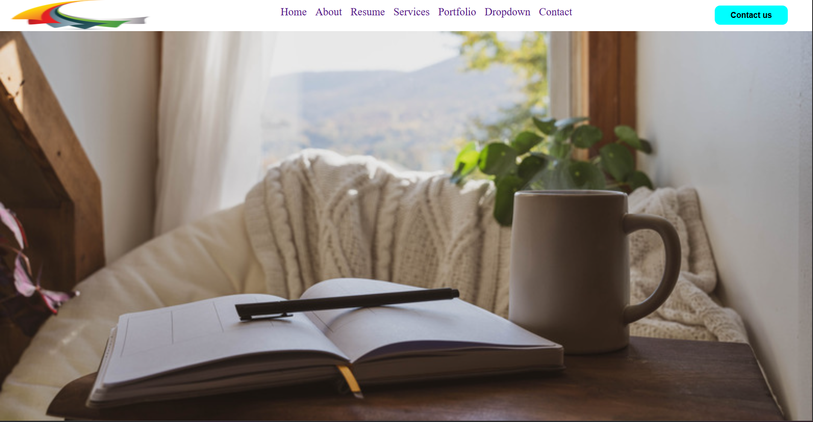

# Grid Template 4

Overview
--------

This layout demonstrates a simple one-column CSS Grid page with three main rows: `header`, `text-content` (hero/background), and `footer`. The header uses an internal grid to place the logo, navigation, and right-side action (contact button).

Files
-----

- `index.html` — Demo markup with semantic sections: header, text-content, footer.
- `index.css` — Grid definitions and responsive media queries.
- `img/` — Images used by the layout; preview images are included in this README (`img/screenshort-1.png`, `img/screenshort-2.png`).

Layout details
--------------

- Top-level grid: `grid-template-rows: 60px 100vh 60px;` places a fixed header, a full-height hero area, and a footer.
- Header: implemented as a nested grid (`grid-template-columns: 20% 65% 15%`) for logo, menu, and icons-right areas. On small screens a media query reflows the header into two rows so the menu stacks below the logo and icons.
- Text-content: uses a background image (`img/content-img.jpg`) sized to `cover` for a hero/banner effect.

Responsive behavior
-------------------

- Media queries reduce the header height and switch its internal grid to two rows on narrow viewports (`max-width: 400px`), and adjust the hero background sizing to `contain` and a smaller height.

Media queries (what was added)
-----------------------------

- Breakpoint: `@media screen and (max-width: 400px)` — the header grid is redefined to two rows using `grid-template-areas: "logo icons-right" "menu-1 menu-1"` so the navigation stacks beneath the logo and icons for better mobile usability.
- Header adjustments: the `.header` internal grid switches to `grid-template-columns: repeat(2, 1fr)` and the `.menu-1 ul` switches to a column direction so menu items stack vertically.
- Hero adjustments: `.text-content` uses `background-size: contain` and a reduced height (`height: 40vh`) at the breakpoint to keep the banner visible without pushing content off-screen.
- Accessibility note: when stacking the menu, ensure focus order and tap targets remain large enough (use larger `font-size` or `padding` on the menu links) to improve touch usability.

If you want, I can paste the exact media query block from `index.css` into this README for reference.

Customization
-------------

- Change row heights: edit `grid-template-rows` in the `.container` rule.
- Swap header column ratios: adjust `grid-template-columns` in `.header` to change menu/logo sizing.
- Replace the SVG preview files with actual PNG screenshots named the same to show real captures in the README.

Viewing
-------

- Open `index.html` in a browser to view the demo locally.
