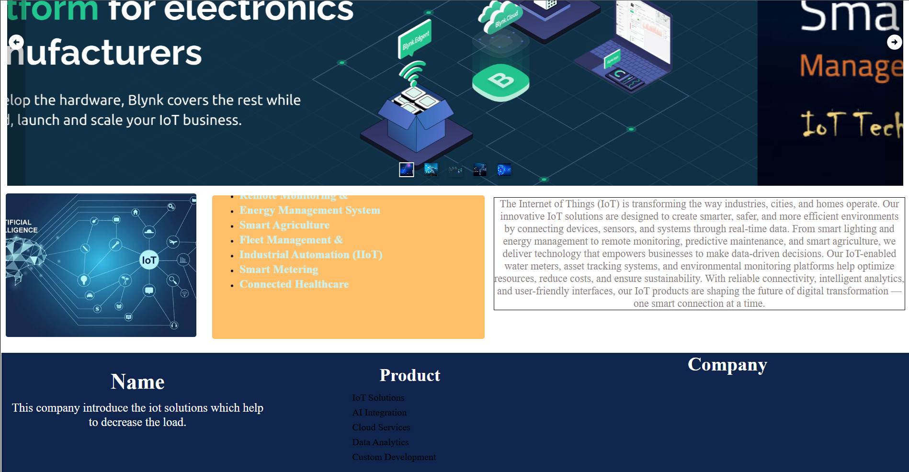

# IoT Solutions — Layout 1

This repository contains the homepage template I created for an IoT Solutions site using "Layout 1". The design focuses on product and feature highlights with a clear visual hierarchy: a full-width header, prominent hero with CTA, a features grid/cards section, and a concise footer. It's suited for showcasing devices, integrations, and solution briefs.

Key points:
- Header with logo and primary navigation.
- Hero area with headline and call-to-action.
- Feature cards/grid for solutions, specs, and benefits.
- Footer with contact and legal links.
- Responsive and accessible: semantic HTML, keyboard-friendly navigation, and readable typography.

Screenshots
- Homepage wide hero and feature area:
  

- Page sections and footer snapshots:
  
