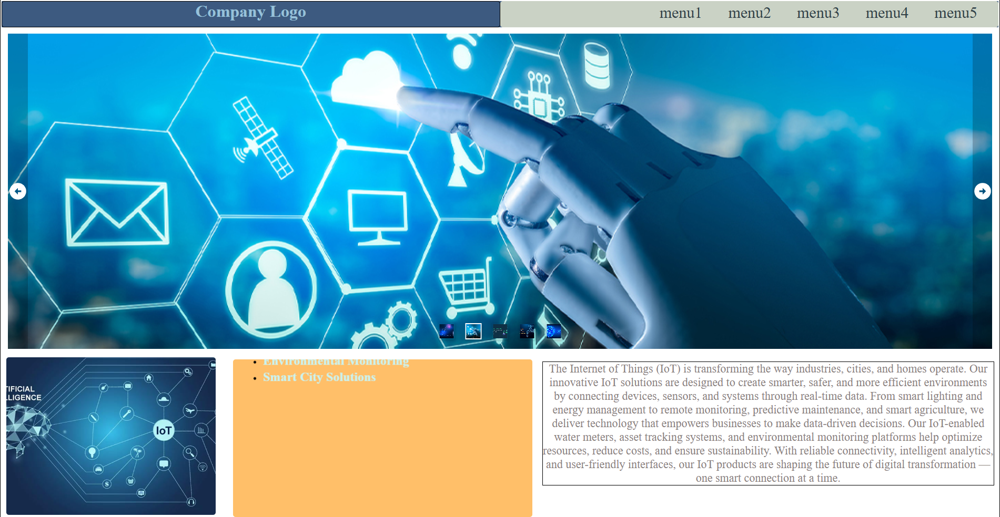

# IoT Solutions — Layout 1

This repository contains a homepage template called **Layout 1** for an IoT Solutions website. The layout is optimized for product and solution storytelling with a clear visual hierarchy: a full-width header, prominent hero with CTA, feature cards/grid, and a concise footer.

**Table of contents**
- Overview
- Preview
- Quick start
- Project structure
- Usage
- Customization
- Accessibility
- Contributing
- License & contact

**Overview**
- **Purpose:** Marketing homepage template for IoT products and services.
- **Design focus:** Clear hierarchy, product highlights, and concise calls-to-action.

**Preview**
- Hero / homepage preview: `img/main-img-1.png`
- Sections & footer: `img/main-img-2.png`

**Quick start**
- Clone the repo:

  `git clone <repo-url>`

- Open the project folder and serve it locally. Example (PowerShell):

  `cd "d:\Tech Hub\github_UI_CSS\layout1"; python -m http.server 8000`

- Or with Node.js `http-server` (if installed):

  `npx http-server . -p 8000`

- Then open `http://localhost:8000` in your browser.

**Project structure (typical)**
- `index.html` : Main homepage markup (entry point).
- `css/` : Stylesheets (global and layout-specific CSS).
- `img/` : Images and screenshots used by the layout.
- `js/` : Optional interactive scripts (menu toggles, sliders).
- `README.md` : This document.

If your repo differs, look for files with similar names.

**Usage**
- Header: edit the logo, navigation items, and links in the header block inside `index.html`.
- Hero: change the main headline, subheading, CTA text, and background image in the hero section.
- Features grid/cards: modify repeating card markup (title, icon/image, body text) to match your products or solutions.
- Footer: update contact links, social links, and legal text.

Example HTML snippet (conceptual):

`<header> ... </header>`
`<main>`
`  <section class="hero"> ... </section>`
`  <section class="features"> ... </section>`
`</main>`
`<footer> ... </footer>`

**Customization**
- Colors & typography: edit the main stylesheet (e.g., `css/styles.css`). If CSS variables are used, change the variables near the top for site-wide updates.
- Images: replace files in the `img/` folder. Keep the same filenames or update markup references.
- Layout: tweak grid and spacing rules in the CSS to adjust card columns and responsive breakpoints.

**Accessibility**
- Use semantic HTML (`header`, `nav`, `main`, `section`, `footer`).
- Ensure all images have descriptive `alt` attributes.
- Keep keyboard focus states visible for interactive elements.
- Use appropriate heading order (`h1` on the page, then `h2`, ...).

**Contributing**
- Suggestions and fixes: open a pull request with a short description of changes.
- Add small, focused commits and include screenshots for visual changes when possible.

**License & contact**
- If this project needs a license, add a `LICENSE` file to the repository. If unsure, consider `MIT` or another permissive license.
- For questions or help, update the `README` contact section or open an issue in the repository.

---

If you'd like, I can:
- generate a `CONTRIBUTING.md` with contributing rules,
- add a sample `index.html` or `css/styles.css` starter file,
- or create a small `docs/` folder with usage examples. Which would you prefer?

