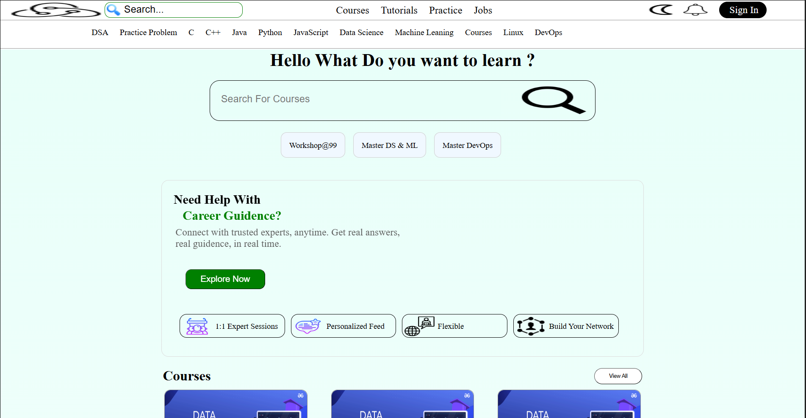
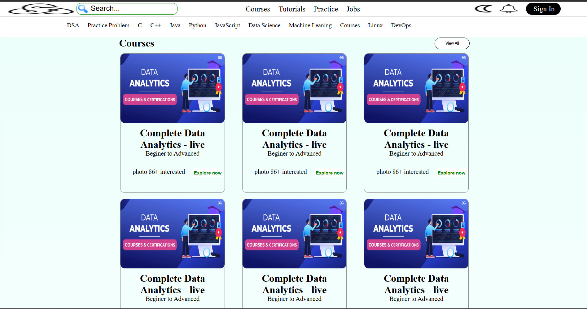
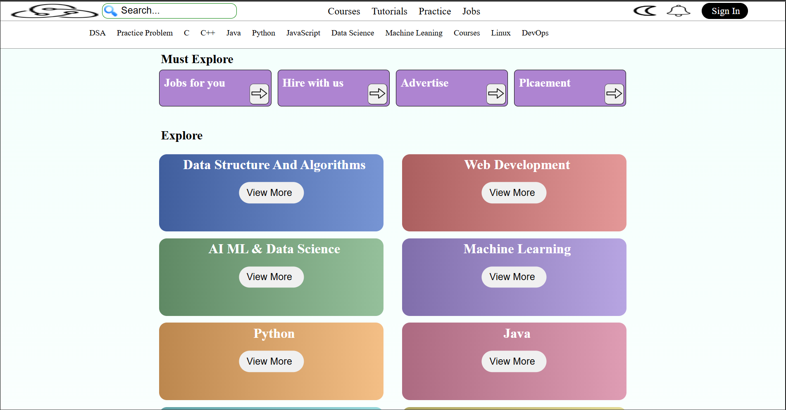
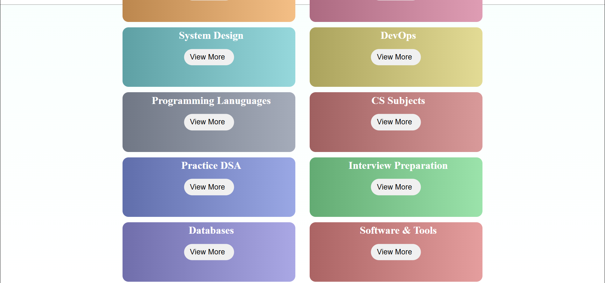

# Layout 5 — GeeksforGeeks Clone

This repository contains a complete clone of GeeksforGeeks (GFG) platform homepage using "Layout 5" template. The design features a modern, multi-section layout with category cards, course listings, and career guidance features — ideal for educational platforms and learning resource sites.

## Key Features

- **Header Navigation** — Logo, search bar, and primary navigation (Courses, Tutorials, Practice, Jobs).
- **Secondary Navigation** — Topic-based quick links (DSA, Practice Problem, C, C++, Java, Python, JavaScript, etc.).
- **Category Grid** — Colorful rounded cards for different learning topics (System Design, DevOps, Programming Languages, CS Subjects, Practice DSA, Interview Preparation, Databases, Software & Tools).
- **Call-to-Action Section** — "Must Explore" horizontal cards with icons and navigation arrows (Jobs for you, Hire with us, Advertise, Placement).
- **Course Cards** — Grid layout displaying course offerings with thumbnail images, titles, difficulty levels, enrollment info, and "Explore now" buttons.
- **Career Guidance Section** — Prominent CTA with benefits (1:1 Expert Sessions, Personalized Feed, Flexible, Build Your Network).
- **Search & Discovery** — Prominent search functionality to explore courses and resources.s

## Screenshots

- **Homepage Hero & Category Grid:**
  

- **Must Explore Section:**
  

- **Courses Grid:**
  

- **Search & Career Guidance:**
  