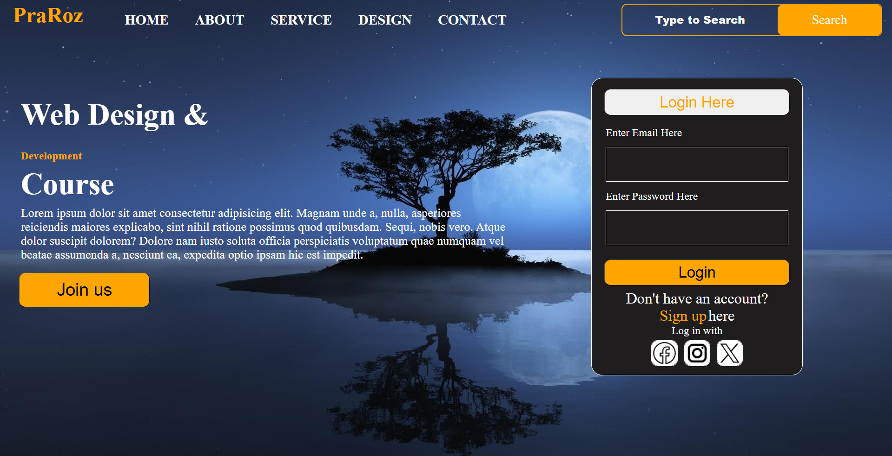

# PraRoz — Web Design & Development Template

A lightweight HTML & CSS template for a landing page featuring a header navigation, search bar, hero content section, and a login widget. This repository contains the markup, styles, icons, and images used to create the design.

---

## 👀 Preview



---

## ✨ Features

- Responsive header with logo and navigation
- Built-in search bar UI element
- Hero area with title, description and call-to-action
- Login widget with email/password fields and social login icons
- Background images and icons included in the `img/` and `icons/` folders

---

## 📁 Project Structure

```
layout_6/
├─ css/
│  └─ index.css           # Main stylesheet
├─ icons/
│  ├─ facebook.png
│  ├─ instagram.png
│  └─ twitter.png
├─ img/
│  ├─ backgroundImage.webp
│  ├─ img1.jpg
│  ├─ img2.jpg            # Background image used by the template
│  └─ pagesimage.png      # Screenshot used in this README
├─ pages/
│  └─ index.html          # Main demo page
└─ README.md
```

---

## 🚀 How to view

1. Open `pages/index.html` in your browser for a static preview (double-click or right-click → Open with → Browser).
2. Run a simple local server (recommended to avoid relative path problems for images):

```powershell
# From the project root
python -m http.server 8000

# Then open in a browser:
http://localhost:8000/pages/index.html
```

Tip: If you use VS Code, you can install the Live Server extension and click "Go Live".

---

## 🔧 How to customize

- Edit `pages/index.html` to modify structure and markup (menu items, hero copy, etc.).
- Edit `css/index.css` to change colors, fonts, spacing, and responsive behavior.
- Replace images inside the `img/` folder and update the CSS/HTML paths as needed.

---

## 📣 Notes

- This is a static template (HTML & CSS only). No JavaScript or backend login system is included — the Login widget is for UI demonstration only.
- If you'd like, I can add a small demo server, mobile responsive breakpoints, or turn the login form into a mocked JavaScript login.

---

## 🧾 License

This project is provided as-is for learning and demonstration purposes. You can use and modify it for your own projects. If you add a license, update this section accordingly.

---

## 🙌 Credits

Template created by the repository owner as a layout demo. Icons sourced locally from the `icons/` folder.

